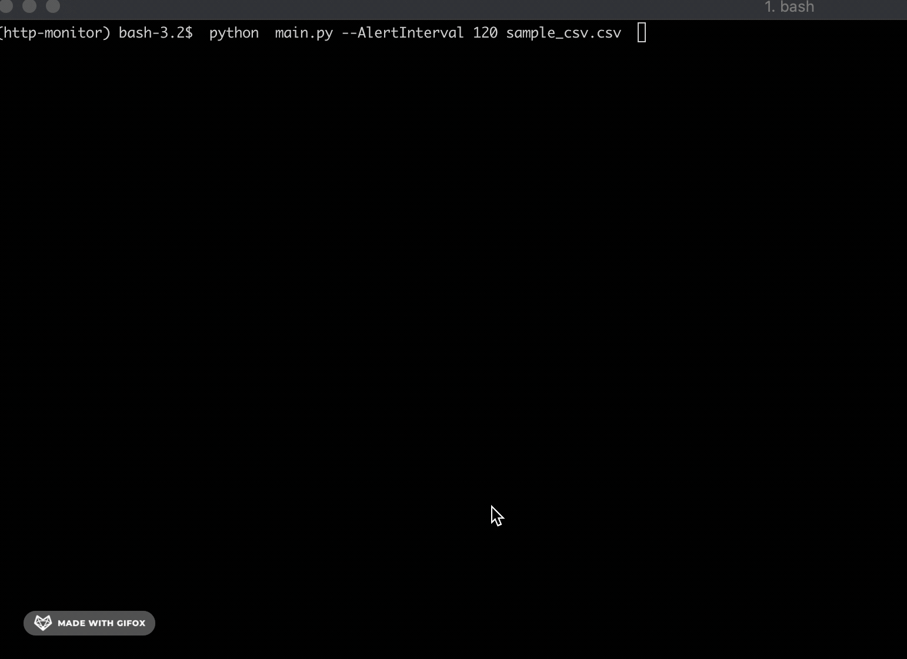

Installation
------------

If you\'re on MacOS, you can install Pipenv easily with Homebrew:

    $ brew install pipenv

Otherwise, refer to the [documentation](https://docs.pipenv.org/install/) for instructions.

To Run APP
----------

    $ cd /httpMonitor
    $ pipenv shell
    $ pipenv install
    $ cd src/
    $ python  main.py sample_csv.csv 
 To Run Test
 -------------
   $ pipenv shell
   $ pytest 
   

App Help, Optional Flags
-------------------

    $ python main.py -h
    
    $ usage: main.py [-h] [--AlertInterval ALERTINTERVAL]
               [--StatsInterval STATSINTERVAL]
               FileName

     Monitor log stats based on provided intervals from supplied csv file

     positional arguments:
     FileName              Provide file name of csv logs

     optional arguments:
      -h, --help            show this help message and exit
      --AlertInterval ALERTINTERVAL
                        provide alert interval in seconds ex. 120 would equal
                        120s
     --StatsInterval STATSINTERVAL
                        provide stats interval in seconds ex. 10 would equal
                        10s

 
  
  
   
